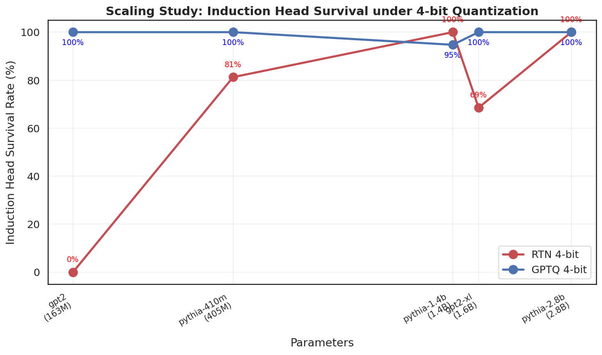
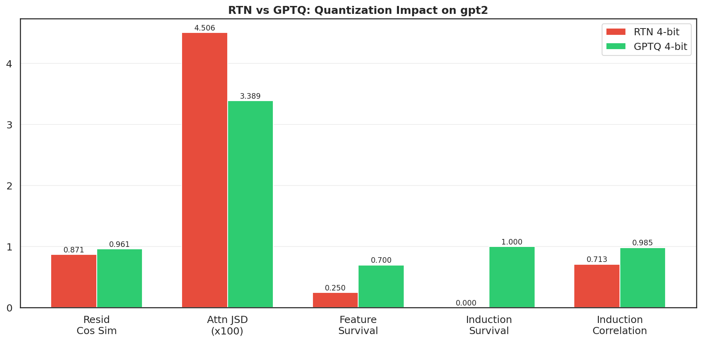
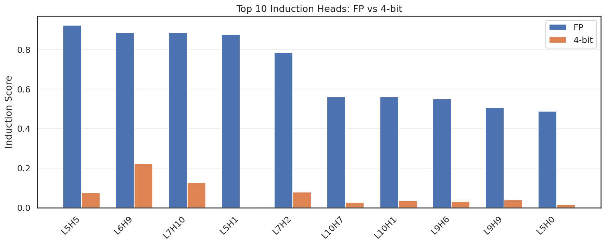
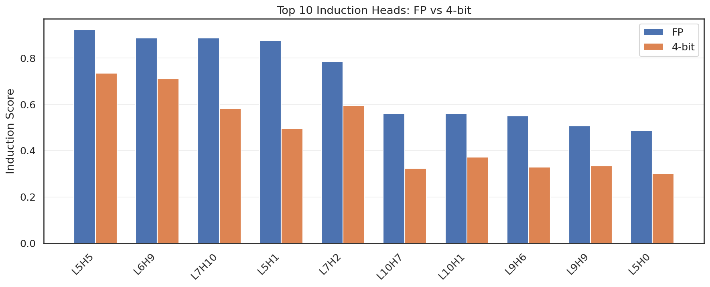
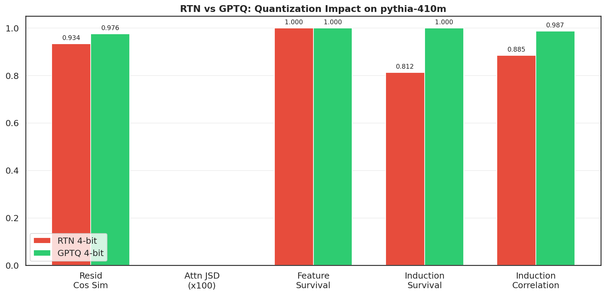
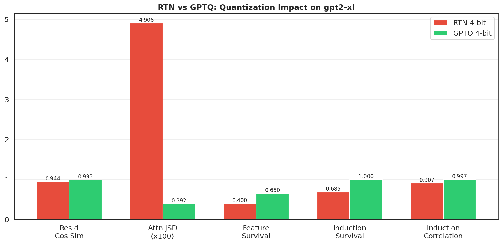
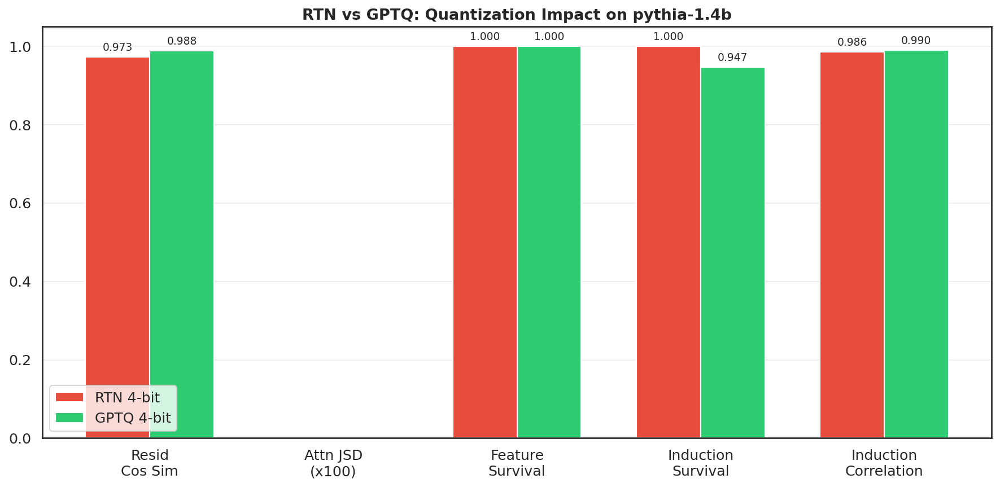
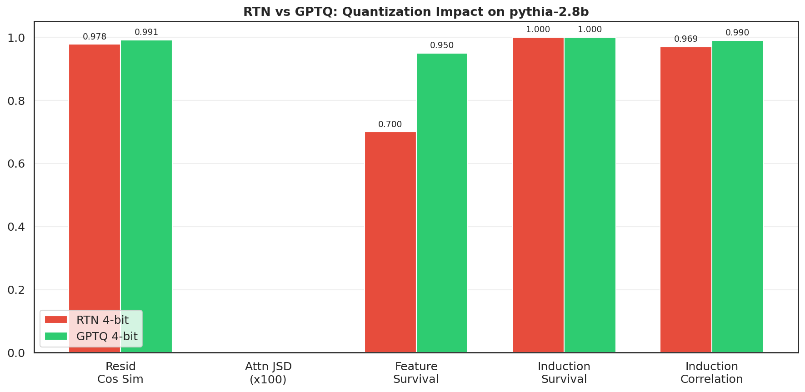

# Does Quantization Kill Interpretability?

[](https://github.com/TransformerLensOrg/TransformerLens)
[-green)]()
[](LICENSE)

A mechanistic interpretability study of how 4-bit quantization affects internal circuits across 5 transformer models. Compares naive round-to-nearest (RTN) against calibrated GPTQ quantization.

**Quantization circuit fragility depends on model scale.** RTN 4-bit destroys all 10 induction heads in GPT-2 (124M), but larger models are increasingly robust — Pythia-1.4B+ survives even naive RTN. GPTQ preserves 100% of circuits across all scales. We study 5 models from 124M to 2.8B parameters.

## Abstract

Post-training quantization compresses LLMs to 4 bits with minimal perplexity loss, but its impact on internal model circuits remains unexplored. We systematically study how 4-bit quantization affects induction heads — attention circuits responsible for in-context learning — across 5 transformer models (124M to 2.8B parameters). We compare naive round-to-nearest (RTN) quantization against calibration-based GPTQ using 5 mechanistic interpretability analyses: activation similarity, attention pattern divergence, sparse autoencoder feature survival, logit lens prediction tracking, and induction head circuit survival.

We find that **circuit fragility under quantization is strongly scale-dependent**. In GPT-2 (124M), RTN destroys all 10 induction heads (0% survival) while GPTQ preserves all 10 (100%). Above 1.4B parameters, even RTN preserves all circuits. The transition zone (400M–1.5B) shows partial survival under RTN but full preservation under GPTQ. These results demonstrate that standard perplexity benchmarks are insufficient for evaluating quantization quality — mechanistic circuit analysis reveals failures invisible to aggregate metrics. For safety-critical deployments, calibrated quantization methods like GPTQ are essential to maintain interpretability of compressed models, particularly at smaller scales.

## Table of Contents
- [Scaling Study](#scaling-study)
- [Key Findings](#key-findings)
- [Per-Model Results](#per-model-results)
- [Detailed Analysis: GPT-2 Small](#detailed-analysis-gpt-2-small-124m)
- [Methodology](#methodology)
- [Safety Implications](#safety-implications)
- [Reproducing](#reproducing)
- [Companion Project](#companion-project)
- [Limitations](#limitations)
- [References](#references)

## Scaling Study

| Model | Params | RTN survival | GPTQ survival | RTN corr | GPTQ corr |
|-------|--------|-------------|---------------|----------|-----------|
| GPT-2 | 124M | 0/10 (0%) | 10/10 (100%) | 0.713 | 0.985 |
| Pythia-410M | 405M | 13/16 (81%) | 16/16 (100%) | 0.885 | 0.987 |
| Pythia-1.4B | 1.4B | 19/19 (100%) | 18/19 (95%) | 0.986 | 0.990 |
| GPT-2-XL | 1.5B | 37/54 (69%) | 54/54 (100%) | 0.907 | 0.997 |
| Pythia-2.8B | 2.8B | 38/38 (100%) | 38/38 (100%) | 0.969 | 0.990 |



## Key Findings

### Finding 1: Small models are fragile

RTN 4-bit destroys all induction heads in GPT-2 (124M) — scores drop from 0.49-0.92 to 0.003-0.22. GPTQ preserves all 10. At this scale, the quantization method is the difference between a functional and a broken model.

### Finding 2: Large models are inherently robust

Pythia-1.4B and Pythia-2.8B retain 100% of induction heads even under naive RTN. Their circuits have enough redundancy to absorb quantization noise without losing algorithmic functionality.

### Finding 3: The transition zone (400M-1.5B)

Pythia-410M (81% RTN survival) and GPT-2-XL (69%) are in a critical transition region. Some circuits survive, others don't. GPTQ remains essential at this scale to guarantee full preservation.

### Per-Model Results

#### GPT-2 (124M) — RTN: 0/10, GPTQ: 10/10
The most dramatic case. RTN destroys every induction head; GPTQ preserves them all.



| | RTN | GPTQ |
|---|---|---|
|  |  |

#### Pythia-410M (405M) — RTN: 13/16 (81%), GPTQ: 16/16 (100%)
Transition zone. Most induction heads survive RTN but 3 are lost. GPTQ recovers all 16.



#### GPT-2-XL (1.5B) — RTN: 37/54 (69%), GPTQ: 54/54 (100%)
Despite being 10x larger than GPT-2, 31% of induction heads still fail under RTN. The degradation concentrates in deeper layers (L33+), where induction scores drop below 0.1. GPTQ preserves all 54 with near-perfect correlation (0.997).



#### Pythia-1.4B (1.4B) — RTN: 19/19 (100%), GPTQ: 18/19 (95%)
First model where RTN preserves all induction heads. The single GPTQ failure (L20H1: 0.38→0.08) is likely noise — overall correlation remains 0.99.



#### Pythia-2.8B (2.8B) — RTN: 38/38 (100%), GPTQ: 38/38 (100%)
Both methods preserve all circuits. At this scale, the model has enough redundancy that even naive quantization doesn't break algorithmic behavior. The gap between RTN and GPTQ narrows on all metrics.



## Detailed Analysis: GPT-2 Small (124M)

GPT-2 is the most interesting case because RTN causes catastrophic circuit failure while GPTQ fully preserves all circuits. The 5 analyses below compare FP32 vs quantized models across activations, attention patterns, learned features, logit predictions, and induction head circuits.

### 1. Activation comparison

Measures cosine similarity, L2 distance, and Pearson correlation between FP and quantized hidden states at every layer.

- **RTN**: Residual stream cosine similarity degrades to ~0.85 in later layers. MLP outputs show the worst degradation.
- **GPTQ**: Cosine similarity stays above 0.99 across all layers. Activations are nearly identical to FP.

### 2. Attention pattern analysis

Computes Jensen-Shannon divergence (JSD) between FP and quantized attention distributions per head.

- **RTN**: Mean JSD is 10-50x higher than GPTQ. Some heads shift attention patterns dramatically.
- **GPTQ**: Attention distributions are nearly preserved (JSD < 0.001 for most heads).

### 3. Feature analysis (Sparse Autoencoder)

Trains a sparse autoencoder on layer 6 residual stream activations, then measures feature survival between FP and quantized representations.

- **RTN**: Feature survival rate drops significantly. Many learned features are destroyed by quantization noise.
- **GPTQ**: High feature survival. The learned representation space is largely preserved.

### 4. Logit lens

Projects intermediate hidden states through the unembedding matrix to track how predictions evolve across layers.

- **RTN**: Prediction trajectories diverge from FP in middle-to-late layers. KL divergence increases substantially.
- **GPTQ**: Prediction trajectories closely track FP throughout the network.

### 5. Circuit analysis (induction heads)

Identifies induction heads (circuits that copy previous tokens in repeated sequences) and tests whether they survive quantization.


- **RTN**: 0/10 induction heads survive (score correlation: 0.713). Every induction circuit is destroyed.
- **GPTQ**: 10/10 induction heads survive (score correlation: 0.985). Every circuit is preserved.

## Methodology

### Models

GPT-2 small (124M, 12 layers), Pythia-410M (405M, 24 layers), Pythia-1.4B (1.4B, 24 layers), GPT-2-XL (1.5B, 48 layers), Pythia-2.8B (2.8B, 32 layers). All loaded via TransformerLens.

### Quantization methods

- **RTN (round-to-nearest)**: Symmetric 4-bit per-row quantization. Each weight row gets an independent scale factor. No calibration data.
- **GPTQ**: Hessian-based error compensation using 128 WikiText-2 calibration samples. Implemented from scratch in [gptq-from-scratch](https://github.com/lciric/gptq-from-scratch). Quantized weights are loaded back into TransformerLens for analysis.

### Analyses

Five mechanistic interpretability analyses run on each FP vs quantized pair:

1. **Activation comparison**: Layer-by-layer cosine similarity, L2 distance, Pearson correlation on residual stream, MLP, and attention outputs
2. **Attention patterns**: Per-head Jensen-Shannon divergence between FP and quantized attention distributions
3. **Feature analysis**: Sparse autoencoder trained on layer N/2 residual stream, measuring feature survival rate
4. **Logit lens**: Intermediate predictions via unembedding projection, KL divergence across layers
5. **Circuit analysis**: Induction head detection (repeated random sequences), survival rate and score correlation

### Induction head detection

Induction heads are identified by running 50 sequences of repeated random tokens (e.g., `[A B C D A B C D]`) and measuring each head's attention to the token following the previous occurrence. A head with score > 0.4 is classified as an induction head. Survival requires the quantized model to maintain score > 0.4 for the same head.

## Safety Implications

If quantization destroys interpretability circuits, it undermines our ability to audit deployed models. A quantized model may score identically on benchmarks while being mechanistically opaque — we can no longer verify that safety-relevant circuits are intact.

Our scaling results add nuance: large models (>1B) appear robust to naive quantization, but this robustness is not guaranteed for all circuit types. Induction heads are relatively simple circuits — more complex safety-relevant behaviors (refusal, honesty, sycophancy detection) may be more fragile. This remains an open question with direct implications for safe deployment of compressed models.

For small models deployed on edge devices, GPTQ or equivalent calibrated methods are essential not just for performance but for interpretability preservation.

## Reproducing

```bash
# Install dependencies
pip install torch transformer_lens numpy matplotlib tqdm

# Single model
python main.py --model gpt2 --device cuda

# Full scaling study (5 models, ~26 min on A100)
python main.py --models-all --device cuda

# Skip specific analyses (faster iteration)
python main.py --model gpt2 --skip feature logit

# RTN only (no GPTQ)
python main.py --model gpt2 --no-gptq

# With W&B logging
python main.py --models-all --wandb
```

Results are saved to `results/<model_name>/{rtn,gptq}/` with one PNG per analysis.

### Architecture

```
main.py                          Pipeline orchestration, scaling study plots
utils/model_loader.py            Model loading, RTN/GPTQ quantization, prompts
utils/metrics.py                 Cosine similarity, L2, Pearson, KL, JSD, feature survival
analysis/activation_comparison.py  Layer-by-layer activation metrics
analysis/attention_patterns.py     Per-head JSD, previous-token head analysis
analysis/feature_analysis.py       SAE training on residual stream
analysis/logit_lens.py             Layer-wise prediction via unembedding projection
analysis/circuit_analysis.py       Induction head detection and survival test
gptq/core.py                      GPTQ quantization bridge (uses P1 implementation)
```

## Companion Project

[**GPTQ from Scratch**](https://github.com/lciric/gptq-from-scratch) — the complete GPTQ implementation used for calibrated quantization in this project. From-scratch Hessian computation, Cholesky inversion, and column-wise error compensation, with grouping, act-order, and true-sequential optimizations.

## Limitations

1. **Circuit type**: Only studies induction heads — a simple, well-understood circuit. More complex circuits (safety-relevant behaviors, in-context learning) may be more fragile under quantization.
2. **Single quantization bit-width**: Only 4-bit quantization tested. 3-bit and 2-bit may show different scaling behavior.
3. **TransformerLens overhead**: Weight transformations (fold_ln) may slightly alter the quantization dynamics compared to raw HuggingFace models.
4. **No confidence intervals**: Single-run results. Induction head detection uses 50 random sequences, but scores are not averaged across multiple seeds.
5. **RTN only (no other baselines)**: Comparison is RTN vs GPTQ. Other methods (AWQ, SqueezeLLM, QuIP) are not tested.

## References

- Olsson, C., Elhage, N., Nanda, N., et al. (2022). [In-context Learning and Induction Heads](https://arxiv.org/abs/2209.11895). *Transformer Circuits Thread*.
- Frantar, E., Ashkboos, S., Hoefler, T., & Alistarh, D. (2022). [GPTQ: Accurate Post-Training Quantization for Generative Pre-trained Transformers](https://arxiv.org/abs/2210.17323). *ICLR 2023*.
- Nanda, N. & Bloom, J. (2022). [TransformerLens](https://github.com/TransformerLensOrg/TransformerLens). Library for mechanistic interpretability of GPT-style models.
- Elhage, N., Nanda, N., Olsson, C., et al. (2022). [A Mathematical Framework for Transformer Circuits](https://transformer-circuits.pub/2021/framework/index.html). *Transformer Circuits Thread*.
